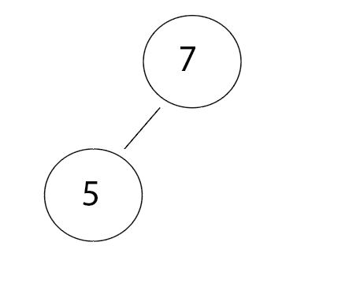
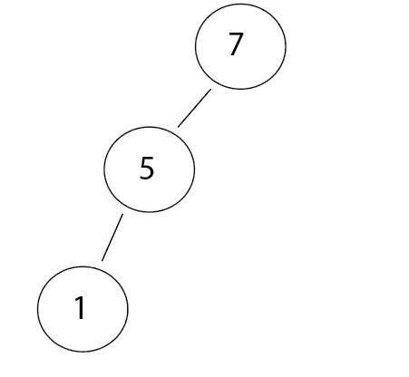
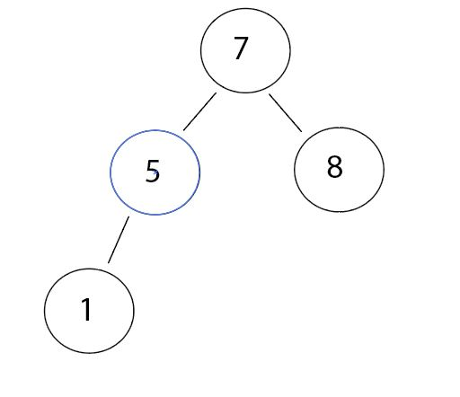
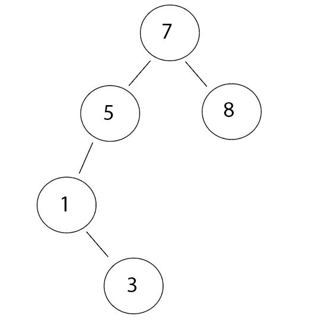
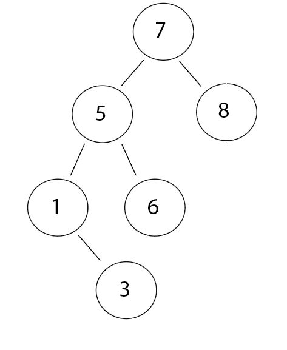
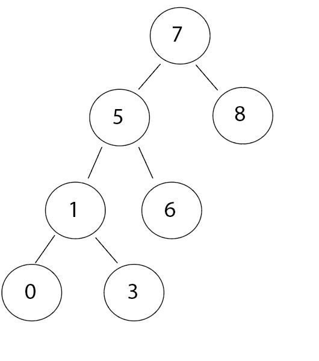
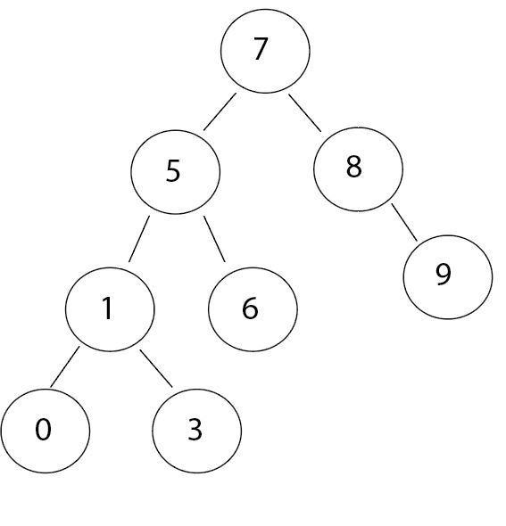
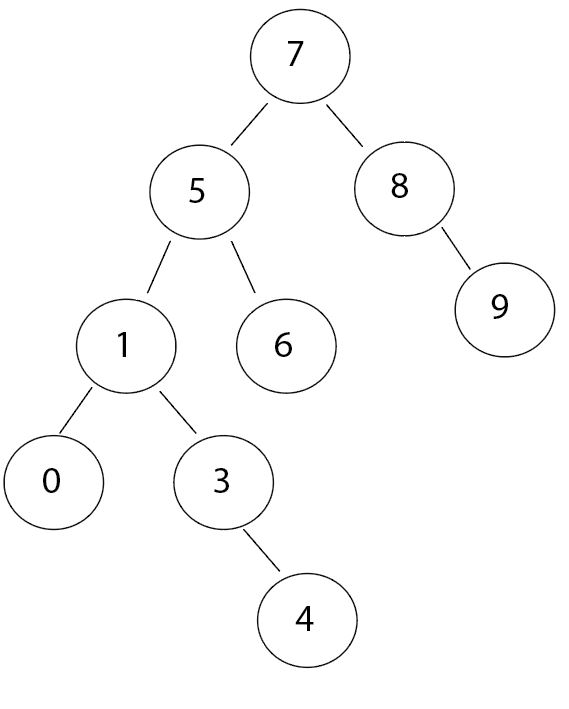
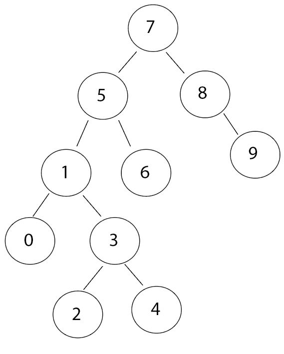

**[7, 5, 1, 8, 3, 6, 0, 9, 4, 2] dizisinin Binary-Search-Tree aşamalarını yazınız.**  

Dizi 7 rakamı ile başlamaktadır. Root node olduğunu düşünerek en başa yerleştiriyoruz. Buna göre bir sonraki değer 7'den büyükse sağ tarafa, küçükse sol tarafa yazılacak. İkinci elemanımız olan 5, 7'den küçük olduğu için sol tarafa alıyoruz.     
    
İkinci adımda üçüncü elemanımız olan 1, 7 den küçüktür. Dolayısıyla solda bulunacak, ama nerede? 1 de 5'ten küçük olduğu için 5'in sol altına yerleşecek. Yani son durum şu şekilde:    
    
Üçüncü adıma geldik. Dördüncü elemanımız olan 8, 7'den büyük. Bu durumda onu sağ tarafa almamız gerekiyor. Nihayet sağ alta bir eleman geliyor :)    
       
Geldik dördüncü adıma. Bunun için beşinci elemanımıza bakıyoruz. 3'müş. 3, 7'den küçük ve sola baktık. 5 var. 3, 5'ten de küçük, sola baktık 1 var. 3, 1'den büyük. O zaman 1'in sağ altına gelecektir.   
     
Beşinci adımda altıncı elemanımız olan 6'yı inceliyoruz. Geldik başa. 6, 7'den küçüktür. Dolayısıyla solda olacak. Solda 5 var. 6 rakamı 5 rakamından büyük. O zaman sağ alta geçecek. Son durumumuz şöyle:     
       
Altıncı adımda yedinci elemanımızın 0 olduğunu gördük. Geldik başa 0<7, sola geç. 0<5, sola geç. 0<1, sola geç. Son durumda 0 elemanı 1'in sol altında bulunacak.   
   
Yedinci adımda sekizinci elemanımıza baktık. 9 rakamı 7 den büyük olduğu için sağa yazılacak. Sağ tarafta 8 var. 8'den de büyük olduğu için 8'in de sağına yazılacak. O zaman son durumumuz şu şekilde:  
  
Geldik sekizinci adıma. Dokuzuncu elemanımız 4'müş. Kontrol edelim en baştan. 4<7, sola geçtik. 4<5, sola geçtik. 4>1, sağa geçtik. 4>3, sağ tarafta olması gerekecek. O zaman 4'ü 3'ün sağ altına yerleştiriyoruz.  
  
Ve son adımdayız. Son elemanımıza baktık. 2<7, sola geç. 2<5, sola geç. 2>1, sağa geç. Sağda 3 var. 2<3, o zaman sola geç. Son durumda 2, 3'ün sol altında olacak. Ve binary search tree hazır :)  
    

  